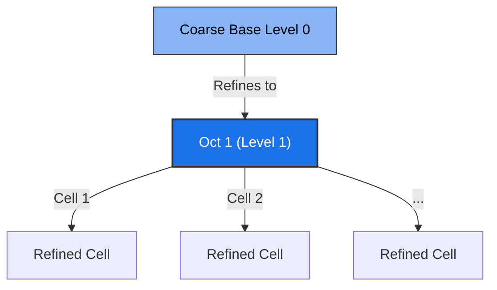

# AMR Grid & Memory Layout

This document provides a deep dive into the design and implementation of the Adaptive Mesh Refinement (AMR) grid storage, memory layout, indexing, and boundary synchronization in RAMSES-CPP.

---

## 🏗️ The AMR Octree Structure

RAMSES-CPP utilizes a fully distributed octree structure to represent the grid refinement levels. The core class managing this tree is [AmrGrid](file:///home/bgkang/Projects/RAMSES-CPP/include/ramses/core/AmrGrid.hpp).

In an octree simulation:
* **Octs:** The basic unit of refinement is an "oct" (or grid). An oct always contains $2^{\text{NDIM}}$ cells (e.g., 2 cells in 1D, 4 cells in 2D, and 8 cells in 3D).
* **Levels:** The grid is structured into refinement levels from `Level 0` (the coarse base grid) up to `levelmax` (the finest allowed level).

### 1-Based Indexing Parity
To guarantee exact parity with legacy Fortran algorithms, the grid pointers preserve **1-based indexing**:
* An index of `0` represents a null pointer (no father, no neighbor, or no son).
* Grid arrays (`father`, `son`, `nbor`, `next`, `prev`, `headl`, `taill`, `numbl`) are 1-based.
* Levels are index-consistent: Level 0 represents the coarse grid cells, while refined octs are indexed from Level 1 up to `levelmax`.



---

## 💾 Memory Layout (Flat Array Mapping)

In legacy Fortran RAMSES, multi-dimensional array memory layout is column-major:
`uold(ncell, nvar)`

In C++, we store all state variables in flat, contiguous 1D vectors (`std::vector<real_t>`) to ensure cache locality when scanning cells. To maintain contiguous strides without translation errors, the variables are mapped as:

```cpp
uold_vec[(ivar - 1) * ncellmax + (icell - 1)]
```

Where:
* `ivar` is the variable index (1-based, e.g., 1 for density, 2 for velocity, etc.).
* `icell` is the cell index (1-based, from 1 to `ncellmax`).
* `ncellmax` is the maximum number of cells allowed at the current allocation size.

This column-major flat array layout ensures that when looping over cells for a single variable (a common pattern in Riemann solvers and hydro fluxes), cache lines are read sequentially.

---

## 🧬 Dynamic Grid Allocation & Resizing

One of the major modernization upgrades in RAMSES-CPP is the elimination of fixed compilation limits on grid memory. In legacy RAMSES, running out of grid memory (`ngridmax` overflow) crashes the simulation.

RAMSES-CPP implements **automatic dynamic allocation** in [AmrGrid::resize_grids(int new_ngridmax)](file:///home/bgkang/Projects/RAMSES-CPP/src/core/AmrGrid.cpp).

### The Resizing Algorithm
When a refinement burst occurs and the number of active octs exceeds `ngridmax`:
1. A new, larger `new_ngridmax` is calculated (typically doubling the current capacity).
2. All grid-related state vectors (both geometry variables and physical fields like `uold`, `unew`, `flux`) are reallocated.
3. The data is copied using a layout-preserving stride translation:

```cpp
for (int ivar = 1; ivar <= nvar; ++ivar) {
    for (int igrid = 1; igrid <= old_ngridmax; ++igrid) {
        int old_cell_idx = ncoarse + (ivar - 1) * old_ncellmax + (igrid - 1) * ncell_per_grid;
        int new_cell_idx = ncoarse + (ivar - 1) * new_ncellmax + (igrid - 1) * ncell_per_grid;
        std::copy_n(old_uold.begin() + old_cell_idx, ncell_per_grid, new_uold.begin() + new_cell_idx);
    }
}
```

This ensures that:
* Grid indices (`igrid`) remain identical, preserving all octree child-parent pointers.
* Callers require no changes, as data vectors grow transparently under the hood.

---

## 🔍 Neighbor Finding & Boundary Conditions

### 1. Constant-Time Neighbor Lookups
Neighbor finding is critical for calculating fluxes at cell interfaces. Each oct stores a `nbor` pointer vector of size 6 (representing left, right, bottom, top, back, front directions).
* Sibling/cousin neighbors are automatically linked when an oct is created in `make_grid_fine`.
* For cells inside an oct, neighbors are either sibling cells within the same oct or found by querying the parent oct's neighbor list.

### 2. Periodic Boundary Conditions
At the coarsest grid level (Level 0), periodic boundaries are resolved by mapping out-of-bound coordinates back into the simulation box.
* If a neighbor cell index falls outside `nx`, `ny`, or `nz`, the coordinates wrap around:
  $$x_{\text{new}} = (x + nx) \pmod{nx}$$
* This allows shock waves or fluid structures to exit one side of the box and seamlessly enter the opposite side.

### 3. Ghost Cell MPI Synchronization
When running in distributed-memory parallel mode (`MPI=ON`), grid boundaries that interface with a domain owned by a different CPU rank are populated with "ghost cells".
* Ranks exchange boundary slices using the `MpiManager` and pack/unpack buffers.
* The `LoadBalancer` ensures that ranks only communicate boundary slices with immediate geometric neighbors, minimizing networking overhead.
