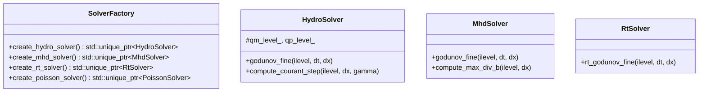

# Polymorphic Physics Solvers

This document describes the polymorphic architecture, Riemann solvers, and algorithms implemented in the physics modules of RAMSES-CPP.

---

## 🏗️ Solver Factory & Polymorphic Design

RAMSES-CPP delegates the instantiation of physics solvers to the [SolverFactory](file:///home/bgkang/Projects/RAMSES-CPP/include/ramses/SolverFactory.hpp). Based on the compilation configurations and user-defined flags (`SOLVER`, `RT`), the factory instantiates the appropriate derived solver classes.

---

## 🌊 Hydrodynamics Solver (`HydroSolver`)

The [HydroSolver](file:///home/bgkang/Projects/RAMSES-CPP/include/ramses/HydroSolver.hpp) implements a second-order Godunov method (MUSCL-Hancock) to solve the Euler equations of gas dynamics:

$$\frac{\partial}{\partial t} \begin{pmatrix} \rho \\ \rho \mathbf{v} \\ E \end{pmatrix} + \nabla \cdot \begin{pmatrix} \rho \mathbf{v} \\ \rho \mathbf{v} \otimes \mathbf{v} + P \mathbf{I} \\ (E + P)\mathbf{v} \end{pmatrix} = 0$$

### 1. MUSCL-Hancock Reconstruction
* **Predictor Step:** Cell-average values are reconstructed to cell faces using slope limiters (MinMod, Monotonized Central, or Superbee) and advanced by half a timestep ($\Delta t / 2$) to ensure second-order temporal accuracy.
* **Corrector Step:** Multi-dimensional fluxes at cell interfaces are computed using a Riemann solver and added to update cell states.

### 2. Available Riemann Solvers
* **HLLC (Harten-Lax-van Leer-Contact):** Resolves contact discontinuities accurately. Default and recommended for standard gas dynamics.
* **Exact Solver:** A Newton-Raphson-based Rankine-Hugoniot solver. Highly accurate but computationally expensive.
* **Acoustic Solver:** A linearized solver suitable for low-Mach flows.
* **LLF (Local Lax-Friedrichs):** Diffusive but extremely stable for extreme shock configurations.

---

## 🧲 Magnetohydrodynamics Solver (`MhdSolver`)

The [MhdSolver](file:///home/bgkang/Projects/RAMSES-CPP/include/ramses/MhdSolver.hpp) solves the equations of ideal Magnetohydrodynamics (MHD) using a **staggered grid representation** (Flux-CT):

### 1. Constrained Transport (Flux-CT)
* Fluid variables ($\rho, P, \mathbf{v}$) are stored at cell centers.
* Magnetic field components ($B_x, B_y, B_z$) are stored on cell faces.
* Electric fields (fluxes) computed at cell edges are used to update the magnetic field. This face-centered staggered layout guarantees that the divergence constraint is maintained to machine precision:
  $$\nabla \cdot \mathbf{B} = 0$$

### 2. HLLD Riemann Solver
* Specially designed for MHD, the HLLD solver resolves the seven waves of the system (including Alfvén waves, fast/slow magnetosonic waves, and contact discontinuities).
* Vital for keeping magneto-rotational instability (MRI) and magnetic reconnection physically consistent.

---

## 🌌 Self-Gravity Module (`PoissonSolver`)

The [PoissonSolver](file:///home/bgkang/Projects/RAMSES-CPP/include/ramses/PoissonSolver.hpp) solves the comoving self-gravity equation on the AMR grid:

$$\nabla^2 \phi = 4\pi G \rho_{\text{physical}}$$

### 1. Geometric Multi-Grid V-Cycle
The solver uses a geometric multi-grid algorithm to achieve fast linear convergence $O(N)$ with cell counts:
1. **Restriction:** Residuals are restricted down to coarser levels.
2. **Coarsest Solve:** The equation is solved directly at the base level (Level 0).
3. **Prolongation:** Correction potentials are prolongated (interpolated) back to fine grids.
4. **Relaxation:** Gauss-Seidel iterations with Red-Black ordering are applied at each step to smooth high-frequency errors.

### 2. Particle Coupling (CIC Projection)
* Mass from N-body dark matter, star, or sink particles is mapped onto the grid using a **Cloud-In-Cell (CIC)** projection scheme.
* Once the potential $\phi$ is solved, forces ($-\nabla \phi$) are interpolated back to particle locations to advance their coordinates.

---

## ⚛️ Auxiliary Solvers

* **RtSolver (Radiation Transport):** Solves radiative transfer equations using the M1 closure relation, tracking photon group density/fluxes and coupling them with a chemical network.
* **RhdSolver (Relativistic Hydrodynamics):** Solves special relativistic fluid dynamics using Newton-Raphson primitive recovery and TM equations of state.
* **TurbulenceSolver:** Adds stochastic, divergence-free forcing in Fourier space using mode-sum spectral driving to simulate interstellar medium (ISM) turbulence.
* **SinkSolver:** Manages accretion and dynamic creation of sink particles.
* **StarSolver:** Handles gas-to-particle conversion (star formation) using Poisson statistics.
* **FeedbackSolver:** Models supernova energy and metal enrichment.
