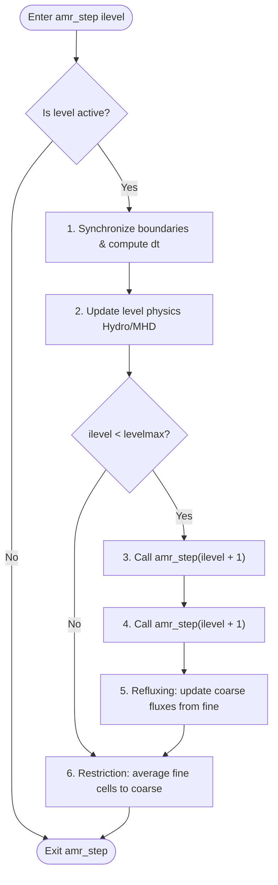

# Time Integration & Subcycling

This document explains the time integration scheme and the recursive Adaptive Mesh Refinement (AMR) subcycling loop in RAMSES-CPP.

---

## 🔁 The Recursive `amr_step` Loop

RAMSES-CPP utilizes a recursive subcycling algorithm to integrate the equations of hydrodynamics and gravity. Rather than advancing the entire grid with a single global timestep, each AMR level $l$ is advanced with its own timestep $\Delta t_l$.

* A coarser level is advanced first.
* The finer levels are advanced twice (since $\Delta t_{l+1} \approx \frac{1}{2} \Delta t_l$) before the coarser level completes its step.
* This ensures that resources are focused on high-resolution regions without wasting compute cycles on coarse regions.

### High-Level Flowchart
The following diagram illustrates the flow of `amr_step(ilevel)` for a given level:

---

## ⏱️ Timestep Calculation & CFL Condition

The timestep at each level is governed by the **Courant-Friedrichs-Lewy (CFL)** stability condition.

### 1. Fluid Velocity and Sound Speed
For hydrodynamics and MHD, the timestep limit is computed based on the maximum signal velocity in any cell at that level:
$$\Delta t_l = C_{\text{cfl}} \frac{\Delta x_l}{|v| + c_s}$$

Where:
* $C_{\text{cfl}}$ is the Courant factor (typically $0.8$).
* $\Delta x_l$ is the cell size at level $l$.
* $v$ is the fluid velocity.
* $c_s$ is the sound speed (or fast magnetosonic wave speed in MHD).

### 2. Timestep Flooring
To prevent simulation crashes in extremely low-density or vacuum regions (which can cause sound speed to diverge to infinity and collapse the timestep to zero), the solver implements a **trace-step floor**:
* Sound speed and timesteps are restricted from dropping below a hardcoded safety minimum.

---

## 🔄 Boundary Synchronization, Refluxing & Restriction

To maintain mass, momentum, and energy conservation across refinement boundaries (where coarse cells touch fine cells), two key operations are performed:

### 1. Refluxing (Flux Correction)
At refinement boundaries, the flux computed by the coarse solver does not exactly match the sum of the fluxes computed by the fine solver over the sub-steps. 
* After the finer level completes its two sub-steps, a **refluxing** operation is performed to correct the coarse cells adjacent to the boundary:
  $$U_{\text{coarse}}^{\text{corrected}} = U_{\text{coarse}} + \frac{\Delta t_{\text{fine}}}{\Delta x_{\text{coarse}}} \left( F_{\text{coarse}} - \sum F_{\text{fine}} \right)$$

### 2. Restriction (Fine-to-Coarse Averaging)
Once a level step is complete, the underlying coarser level must be updated to match the fine level solution. This is done by volume-averaging the state variables of the child cells:
$$U_{\text{father}} = \frac{1}{2^{\text{NDIM}}} \sum_{i=1}^{2^{\text{NDIM}}} U_{\text{child}, i}$$
